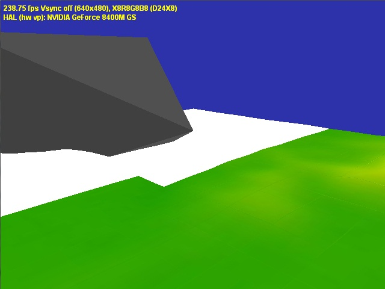

# VolRender

- [Introduction](#introduction)
- [Screenshots](#screenshots)
- [Building the project](#building-the-project)
- [Running the project](#running-the-project)

# Introduction
GigaRender implements graphics content streaming optimized for terrain data(geometry + textures) between hard disk and graphics card memory with staging through the system memory to provide seamless display of large scenes.
The project allows scenes with large graphical content (e.g. Big Cities) to run on lower computer configurations using the technique of load-on-demand, where only the visible parts of the scene are loaded into the video memory from the hard-drive.
The loading process is done transparently in background threads.

# Screenshots

# building the project
To build the project first you need to have DirectX 9.0c or later installed.  
Open GigaRender.sln with Visual Studio and run build all command.

# Running the project
Once the project has been built, follow these steps to launch the project:
- Go to GigaRender\Dist folder
- Run TerraGen_d.exe which builds a default test map of the size 4096x4096 .. You need to run this only once.
- The TerraGen program will produce 5 files:
	- HeightMap.bmp (a gray scale image that represents the height map)
	- Texture.bmp (a colored image containing texture information)
	- major (a binary file that describes the map size, vertex spacing, ..) [REQUIRED]
	- map (a binary file that holds the geomerty data of the terrain preprocessed
	 and optimized for GigaRender streaming) [REQUIRED]
	- textures (a binary file that holds a preprocessed and optimized version of 
	 terrain texture) [REQUIRED]
- Within GigaRender\Dist folder create a Resources sub-folder.
- Within GigaRender\Dist\Resources create a map0 sub-folder.
- Copy the 3 required generated files (major, map, and textures) to the map0 folder
- Go back to GigaRender\Dist folder
- Run GigaRender_d.exe
